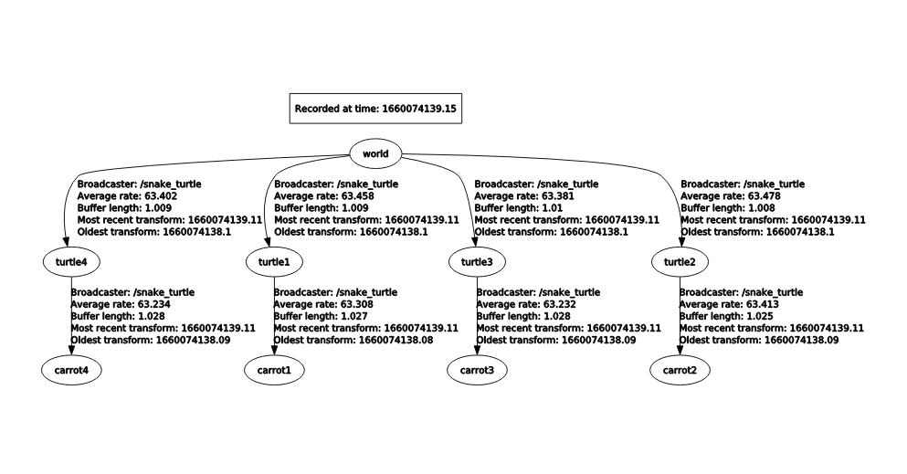
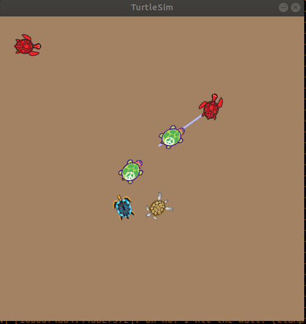

# turtlesim_snake
This project is an implementation of the classic snake game using the ros turtlesim and tf.

This project has been developed in python in a ros melodic environment.

To play this game, clone the project and compile using the command

        catkin_make
    
Then source the workspace by running:

        source devel/setup.bash

And launch the project by:

        roslaunch turtlesim_snake start_demo.launch

And the project has been launched, the arrows may be used to move the principal turtle towards the static turtle.
The goal is to reach the static turtles so that this turtle follows the first and a new one is spawned.

When the project is launched two turtles are generated, one that can be controlled using the arrows and a second which is static. 
There are two tf frames generated for each turtle, */turtleX*, its position who's parent is */world* and a */carrotX* which is a child positioned 0.5 m offset of its parent frame.

There is a check done between */turtle1* and the latest */turtleN*, when it gets to region of a defined parameter in the launchfile using a tf to find the difference between two frames. 
Once the check is completed, a new turtle is spawned at a random position and the backgroud is changed to a new random colour.
This turtle will now follow the child frame */carrotX* at a 1 second in the past

